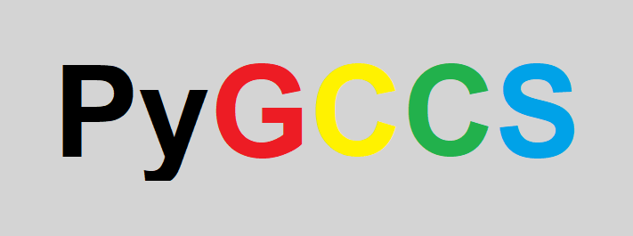

[![Contributors][contributors-shield]][contributors-url]
[![Forks][forks-shield]][forks-url]
[![Stargazers][stars-shield]][stars-url]
[![Issues][issues-shield]][issues-url]
[![MIT License][license-shield]][license-url]
[![LinkedIn][linkedin-shield]][linkedin-url]

<!-- PROJECT LOGO -->
<br />
<p align="center">
<p align="center">
  
</p>

<!-- ABOUT THE PROJECT -->

## About The Project

Looking for a way to link some of your machine learning or business workflows to Cloud Storage? Then this is the perfect
package for you. However, you'd have to **create a service account key** first so please go
there check how to [create a service account key](https://cloud.google.com/iam/docs/creating-managing-service-account-keys?hl=en#console).

<!-- TABLE OF CONTENTS -->
<details open="open">
  <summary>Table of Contents</summary>
  <ol>
    <li>
      <a href="#about-the-project">About The Project</a>
    </li>
    <li>
      <a href="#getting-started">Getting Started</a>
    </li>
    <li><a href="#usage">Usage</a></li>
    <ul>
        <li><a href="#upload">Upload</a></li>
        <li><a href="#download">Download</a></li>
    </ul>
    <li><a href="#contact">Contact</a></li>
  </ol>
</details>

<!-- GETTING STARTED -->

## Getting Started

To install this package in your own projects, please use the commands below.

1. Clone the repo

```shell
git clone https://github.com/DvdNss/PyGCCS.git
```

2. Move to the repo folder

```shell
cd PyGCCS
```

4. Install requirements

```shell
pip install -r requirements.txt
```

<!-- USAGE EXAMPLES -->

## Usage

### Upload

* For a single file:

```shell
python ./PyGCCS/upload.py -p gc_project_id -b bucket_name -d folder_in_bucket -r filename_for_destination -f local_filename -k path_to_IAM_json_key
```

* For several files:

```shell
python ./PyGCCS/upload.py -p gc_project_id -b bucket_name -d folder_in_bucket -f "local_filename_1&local_filename_2" -k path_to_IAM_json_key
```

* For a folder (all files of the folder will be uploaded one by one to the folder in your bucket):

```shell
python ./PyGCCS/upload.py -p gc_project_id -b bucket_name -d folder_in_bucket --folder local_folder -k path_to_IAM_json_key 
```

* You can also use the function:

```python
from PyGCCS.upload import upload_to_bucket

upload_to_bucket(
    project_id="gc_project_name",  # GCP project name
    bucket_name="bucket_name",  # Cloud storage bucket name 
    destination="destination_folder_in_bucket",  # Folder to put  files in in bucket
    files="files_separated_by_&",  # Set to None for folder
    folder="local_folder_to_upload",  # Set to None for files only 
    key="path_to_IAM_json_key"  # Path to IAM service account json key
)
```

### Download

* For a single file:

```shell
python ./PyGCCS/download.py -p gc_project_id -b bucket_name -d local_folder_to_put_files_in -f files_to_download_separated_by_& -k path_to_IAM_json_key
```

* You can also use the function:

```python
from PyGCCS.download import download_from_bucket

upload_to_bucket(
    project_id="gc_project_name",  # GCP project name
    bucket_name="bucket_name",  # Cloud storage bucket name 
    destination="local_destination_folder",  # Folder to put files in (local)à
    files="files_to_download_separated_by_&",  # files to download
    key="path_to_IAM_json_key"  # Path to IAM service account json key
)
```

<!-- CONTACT -->

## Contact

David NAISSE - [@LinkedIn](https://www.linkedin.com/in/davidnaisse/) - private.david.naisse@gmail.com

<!-- MARKDOWN LINKS & IMAGES -->
<!-- https://www.markdownguide.org/basic-syntax/#reference-style-links -->

[contributors-shield]: https://img.shields.io/github/contributors/DvdNss/PyGCCS.svg?style=for-the-badge

[contributors-url]: https://github.com/DvdNss/PyGCCS/graphs/contributors

[forks-shield]: https://img.shields.io/github/forks/DvdNss/PyGCCS.svg?style=for-the-badge

[forks-url]: https://github.com/DvdNss/PyGCCS/network/members

[stars-shield]: https://img.shields.io/github/stars/DvdNss/PyGCCS.svg?style=for-the-badge

[stars-url]: https://github.com/DvdNss/PyGCCS/stargazers

[issues-shield]: https://img.shields.io/github/issues/DvdNss/PyGCCS.svg?style=for-the-badge

[issues-url]: https://github.com/DvdNss/PyGCCS/issues

[license-shield]: https://img.shields.io/github/license/DvdNss/PyGCCS.svg?style=for-the-badge

[license-url]: https://github.com/DvdNss/PyGCCS/blob/master/LICENSE.txt

[linkedin-shield]: https://img.shields.io/badge/-LinkedIn-black.svg?style=for-the-badge&logo=linkedin&colorB=555

[linkedin-url]: https://www.linkedin.com/in/dvdxnss/